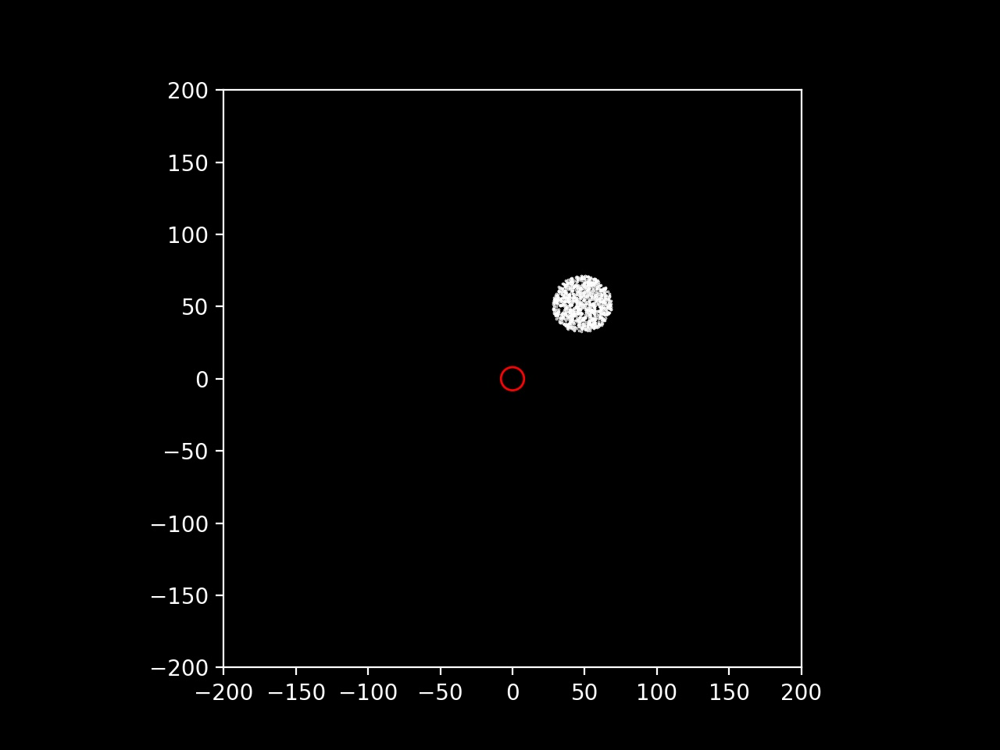
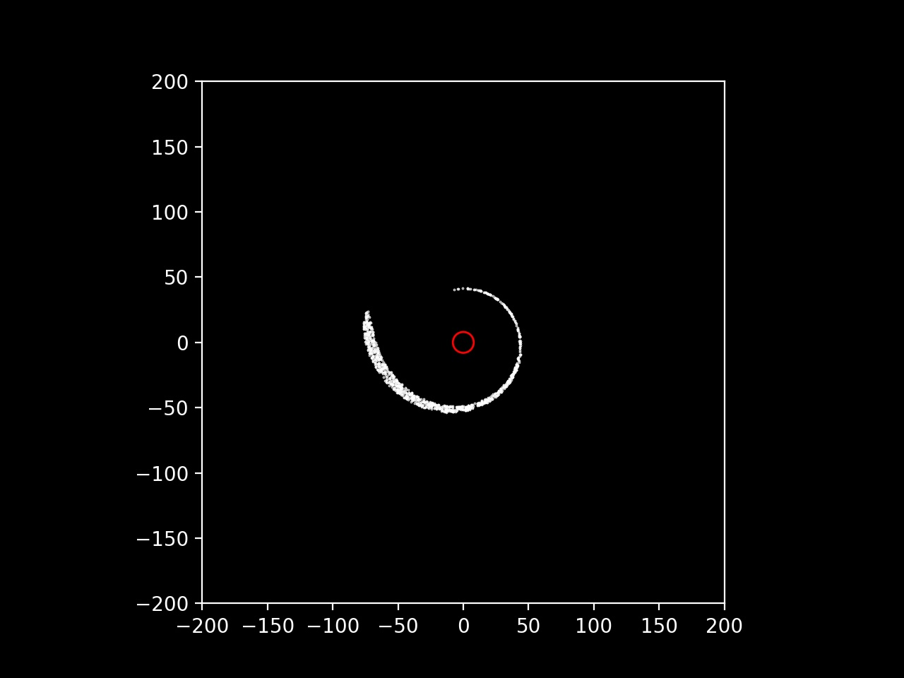
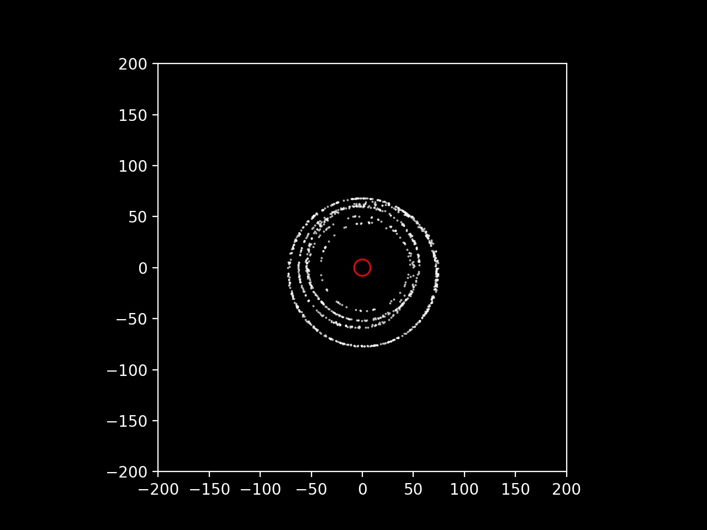

# Schwarzschild black hole particle simulation

This is step one in my black hole simulation project series. The goal of this first step is to create a tool that takes an initial state of a set of particles and steps them through time, tracing their trajectories in a Schwarzschild black hole spacetime.

</img>

# What is included

- `simulate.py` a Python script that simulates the motion of particles in a Schwarzschild black hole spacetime. The final results are saved to a compressed output file.
- `plot.py` a Python script that plots the trajectories of the particles.

# What does this show us?

One important aspect to notice here is that when a spherical object, such as a star, enters within the viscinity of the black hole's gravitational warping, as time goes to infinity, the geometry of the object slowly stretches and flattens out into a disk around the black hole. A so called "accretion disk."

<div style='display: flex; flex-direction: row; justify-content: center'>
</img>
</img>
</img>
</div>

# Usage

1. Clone the repository

```bash
git clone https://github.com/cadenmarinozzi/Schwarzschild-black-hole-simulation
cd Schwarzschild-black-hole-simulation
```

2. Install the required packages

```bash
pip install -r requirements.txt
```

3. Run the simulation

```bash
python3 simulate.py
```

4. Plot the results

```bash
python3 plot.py
```
